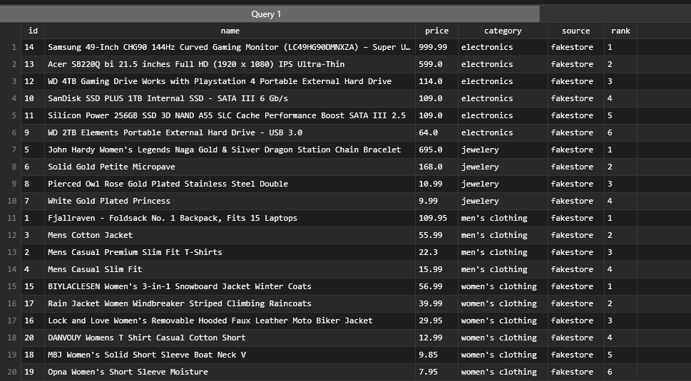
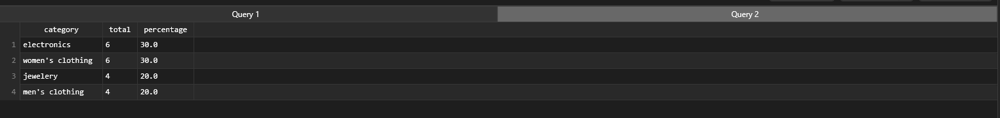

# MiniCatalogo API

API REST construida con **FastAPI** que sincroniza productos desde la [FakeStore API](https://fakestoreapi.com/products) hacia una base de datos SQLite local, con sistema de carrito de compras persistente.

---

## Tecnologías

- **Python 3.10+** — lenguaje principal
- **FastAPI** — framework web REST
- **SQLite** — base de datos local
- **Uvicorn** — servidor ASGI
- **Pydantic** — validación de datos
- **Requests** — consumo de API externa

---

## Estructura del proyecto

```
Prueba-Tecnica/
├── app/
│   ├── database.py          # Conexión y creación de la DB
│   ├── repository.py        # CRUD de productos
│   ├── cart_repository.py   # CRUD del carrito
│   ├── sync.py              # Sincronización con FakeStore API
│   └── main.py              # Endpoints FastAPI
└── sql/
    ├── schema.sql           # Definición de tablas
    └── products.db          # Base de datos SQLite 
    ├── q1.sql               # Query para listar los productos más caros por categoría.
    └── q2.sql               # Query para listar el porcentaje de productos por categoría.
```

---

## Requisitos previos

- [Python 3.10+](https://www.python.org/downloads/)
- [Git](https://git-scm.com/)
- `pip` (incluido con Python)

---

## Instalación

### 1. Clonar el repositorio

```bash
git clone https://github.com/Pablownski/Prueba-Tecnica.git
cd Prueba-Tecnica
```


### 3. Instalar dependencias

```bash
pip install -r requirements.txt
```


## Ejecución

### Iniciar el servidor

```bash
python -m uvicorn app.main:app --reload
```

Deberías ver:

```
INFO:     Uvicorn running on http://127.0.0.1:8000 (Press CTRL+C to quit)
INFO:     Application startup complete.
```

### Abrir Swagger UI

Con el servidor corriendo, abre tu navegador y escribe en la **barra de direcciones** (no en el buscador):

```
http://127.0.0.1:8000/docs
```

> Si el puerto 8000 está ocupado, usa otro:
> ```bash
> python -m uvicorn app.main:app --reload --port 8001
> # Luego abre: http://127.0.0.1:8001/docs
> ```

---

## Endpoints

### Productos

| Método | Endpoint | Descripción |
|--------|----------|-------------|
| `POST` | `/sync` | Sincroniza productos desde FakeStore API |
| `GET` | `/products` | Lista productos con paginación (`limit`, `offset`) |
| `GET` | `/products/{id}` | Obtiene un producto por ID |

### Carrito

| Método | Endpoint | Descripción |
|--------|----------|-------------|
| `POST` | `/carts` | Crea un carrito vacío |
| `GET` | `/carts` | Lista todos los carritos con totales |
| `GET` | `/carts/{cart_id}` | Detalle de un carrito con sus items |
| `DELETE` | `/carts/{cart_id}` | Elimina un carrito y sus items |
| `POST` | `/carts/{cart_id}/items` | Agrega un producto al carrito |
| `PATCH` | `/carts/{cart_id}/items/{product_id}` | Actualiza la cantidad de un producto |
| `DELETE` | `/carts/{cart_id}/items/{product_id}` | Elimina un producto del carrito |
| `DELETE` | `/carts/{cart_id}/items` | Vacía todos los items del carrito |

---

## Flujo básico de uso en Swagger

1. Ir a `http://127.0.0.1:8000/docs`
2. Ejecutar **POST /sync** para cargar los productos desde FakeStore API
3. Explorar productos con **GET /products**
4. Crear un carrito con **POST /carts** y guardar el `cart_id` que retorna
5. Agregar productos con **POST /carts/{cart_id}/items** indicando `product_id` y `quantity`
   - Si el mismo producto se agrega varias veces, la cantidad se **acumula**
6. Ver el resumen con **GET /carts/{cart_id}** (incluye subtotales y total general)

---

## Notas

- `products.db` se crea automáticamente en `sql/` al primer inicio del servidor
- Si modificas `schema.sql`, elimina `products.db` y reinicia el servidor para regenerarla
- La URL `127.0.0.1` solo es accesible desde tu propia computadora, no es pública
- Para detener el servidor presiona `Ctrl+C` en la terminal


## Queries
 # Resultado Q1
 


 # Resultado Q2
 